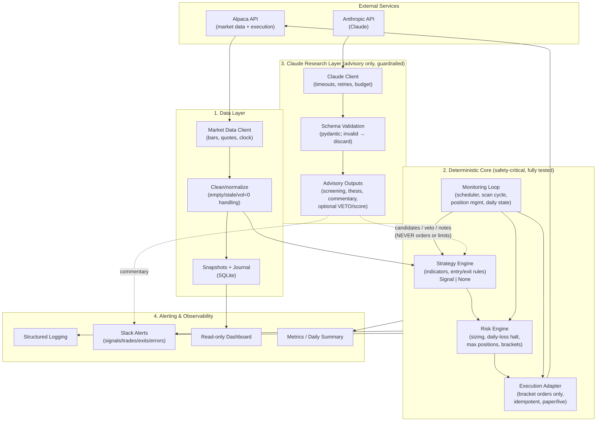

# ARCHITECTURE.md — My-Trade

> High-level system design. The guiding constraint: a **deterministic core** that
> is safe and testable, with a **non-deterministic Claude layer** that can only
> *advise*. See `SCOPE.md` for risk rules and `PROJECT_ROADMAP.md` for sequencing.

---

## 1. Layered Overview



**Reading the diagram:** solid arrows are the trading path (Alpaca → data → core →
Alpaca). Dotted arrows are advisory: Claude output can influence *what to consider*
or *block* a trade, but the order path runs **only** through the deterministic core.

---

## 2. Layer Responsibilities

### Layer 1 — Data Layer  (`src/my_trade/data/`)
- Wrap Alpaca historical/latest data; return tidy, indexed pandas DataFrames.
- Normalize crypto realities: **empty bars, stale timestamps, `volume=0`** are
  detected and surfaced explicitly (never silently treated as valid).
- Persist daily snapshots + a SQLite **journal** of events/trades for audit & dashboard.
- **No trading decisions here.** Pure I/O + cleaning.

### Layer 2 — Deterministic Core  (`src/my_trade/core/`)  ⚠️ safety-critical
The only layer allowed to move money. Fully unit-tested.

- **Strategy** (`core/strategy/`): compute indicators (VWAP/RSI/MACD/Bollinger,
  trend filters), evaluate entry/exit, return a typed `Signal` + structured reasons.
  **Pure** (DataFrame in → decision out, no network, no clock side effects beyond injected time).
- **Risk** (`core/risk/`): fixed-notional sizing, daily-loss halt, max-positions,
  duplicate-entry guard, bracket (stop/TP) price calculation. Prefer pure functions.
- **Execution** (`core/execution/`): translate an approved `TradePlan` into an
  Alpaca **bracket** order. Idempotent; honors paper/live flags; no naked orders.
- **Monitoring** (`core/monitoring/`): the loop/scheduler that ties it together,
  manages open positions (time-stop, RSI exit), and persists restart-safe daily state.

### Layer 3 — Claude Research Layer  (`src/my_trade/research/`)  (Phase 4)
- **Advisory only.** Cannot import or call execution/risk-mutating code.
- Client wrapper: timeouts, retries, per-cycle/day **budget**, global `ENABLE_CLAUDE` kill flag.
- **Every** response is JSON, **schema-validated**. Invalid/late/over-budget →
  discarded; system continues deterministic-only.
- Allowed outputs: candidate screening, catalyst/news/thesis summaries, daily
  commentary, and an optional **confidence score / veto** that can *suppress* a
  deterministic signal — never create or size one.

### Layer 4 — Alerting & Observability  (`src/my_trade/observability/`, `dashboard/`)
- Structured logging (levels + rotation), quiet-by-default scan logs.
- Slack alerts for material events only (entries, exits, errors, kill-switch, daily summary).
- Read-only dashboard (equity, positions, recent events).
- Metrics for backtest + live review.

---

## 3. Core Data Contracts (typed)

Defined in `src/my_trade/core/models.py` (migrated from current `models.py`):

- `Signal` — symbol, side, entry, stop, take-profit, confidence, reasons[], timestamp.
- `TradePlan` — symbol, qty, notional, entry, stop, take-profit, risk_dollars.
- `ScanEvaluation` — eligible?, summary, failures[], metrics{}, near_signal.
- `BacktestResult` — trades, wins/losses, win-rate, avg R, max drawdown, curve path.
- `ResearchAdvice` (Phase 4) — candidates[], theses[], veto?, confidence, raw, valid?.

The same `Signal`/`TradePlan`/strategy/risk code is used by **both** backtest and
live — this is a hard rule (no parallel implementations).

---

## 4. Control Flow (one scan cycle)

1. **Monitoring loop** fires (e.g., every 60s).
2. **Risk pre-checks**: daily-loss halt? max positions? buying power? → if fail, skip.
3. **Data layer** fetches 1m/5m/15m bars; validates freshness/non-empty.
4. **Strategy** evaluates → `Signal | None` (+ reasons).
5. *(Phase 4)* **Claude veto/score** may suppress the signal; never strengthen past rules.
6. **Risk engine** sizes the trade (fixed notional) + computes bracket prices → `TradePlan`.
7. **Execution** submits the **bracket** order (idempotent).
8. **Position management** checks open positions for time-stop / RSI exit.
9. **Observability** logs + alerts on material events; daily state persisted.

Any failure or ambiguity at any step ⇒ **no trade this cycle** (fail safe).

---

## 5. Safety Invariants (enforced in code + tests)

- 🔒 Order/risk mutations exist **only** in `core/execution` and `core/risk`.
- 🔒 `research/` may not import `core/execution` or mutate risk config (enforced by
  design + a guard test that asserts no such import path exists).
- 🔒 Every entry is a bracket (stop + TP) or it is not submitted.
- 🔒 Claude output is untrusted input: validated, bounded, optional, and killable.
- 🔒 Stale/empty/NaN data ⇒ skip. Claude down ⇒ degrade gracefully.
- 🔒 Live requires two explicit flags (`PAPER_TRADING=false` + `ALLOW_LIVE_TRADING=true`).

---

## 6. Target Repository Layout

```
my-trade/
├── SCOPE.md
├── PROJECT_ROADMAP.md
├── ARCHITECTURE.md
├── README.md
├── pyproject.toml            # deps + ruff/mypy/pytest config (Phase 1)
├── .env.example              # never .env
├── src/
│   └── my_trade/
│       ├── __init__.py
│       ├── __main__.py        # CLI entry (run/status/backtest/dashboard)
│       ├── config/            # typed settings (from env)
│       ├── data/              # Alpaca data client, cleaning, journal
│       ├── core/              # DETERMINISTIC, safety-critical
│       │   ├── models.py
│       │   ├── strategy/
│       │   ├── risk/
│       │   ├── execution/
│       │   └── monitoring/
│       ├── research/          # Claude layer (Phase 4, advisory only)
│       └── observability/     # logging, alerting, metrics
├── dashboard/                 # read-only monitoring UI (existing)
├── tests/
│   ├── unit/                  # pure-logic tests (risk, strategy, data cleaning)
│   └── integration/           # adapters w/ mocked Alpaca/Claude
└── docs/
    └── backtests/             # saved backtest summaries
```

> The current flat modules (`strategy.py`, `risk.py`, `broker.py`, …) are the
> **reference prototype**. They migrate into `src/my_trade/` in Phase 1, *with
> tests written first*. The skeleton created now is intentionally non-destructive.

---

## 7. Technology Choices

| Concern | Choice | Notes |
|---|---|---|
| Language | Python 3.11+ | type hints everywhere |
| Broker/data | `alpaca-py` | paper-first |
| Indicators | `pandas` + `pandas-ta` | shared by backtest + live |
| Scheduling | `APScheduler` | 60s scan loop |
| AI layer | Anthropic `claude` SDK | Phase 4, advisory only |
| Validation | `pydantic` | Claude output contracts + settings |
| Tests | `pytest` + coverage | gate ≥ 85% on `core/` |
| Lint/format | `ruff` | fast, single tool |
| Types | `mypy` | core must type-check |
| Dashboard | `fastapi` + `uvicorn` | read-only |
| Alerts | Slack | material events only |

---

_Design changes must be reflected here before implementation. Docs lead code._
